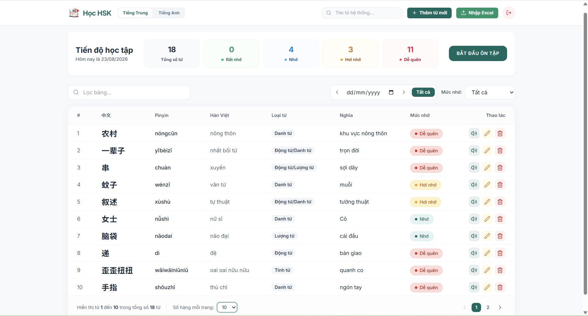
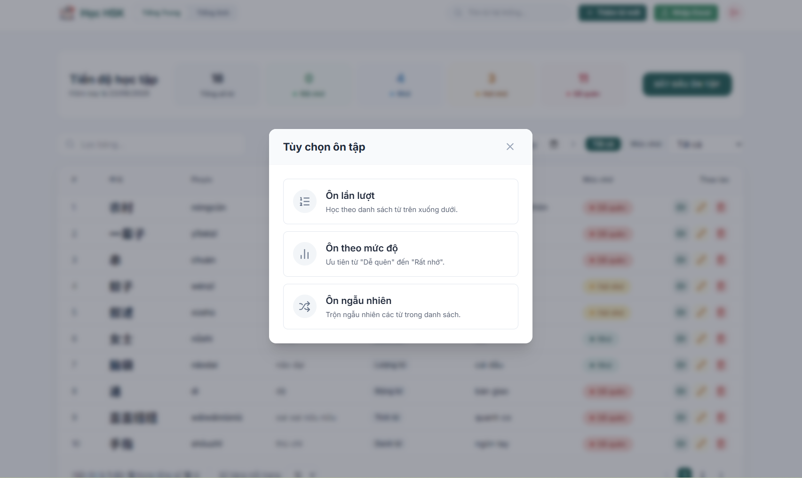
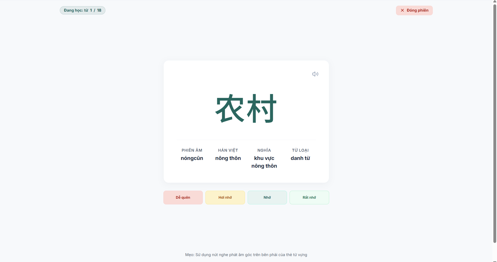

# 🇨🇳 Hệ Thống Ôn Tập Từ Vựng HSK5 & Tiếng Anh

Một ứng dụng web hiện đại, trực quan và tối ưu giúp học viên ôn tập từ vựng tiếng Trung (HSK) và tiếng Anh thông qua thẻ ghi nhớ (Flashcard), tự động phát âm, cùng các tính năng hỗ trợ nhập liệu thông minh và theo dõi tiến độ trực quan.

Hệ thống được thiết kế theo phong cách tối giản, giao diện cao cấp (Premium UI) với hiệu ứng chuyển động mượt mà, mang lại trải nghiệm học tập tốt nhất.

---

## 🚀 Các Chức Năng Chính & Giao Diện Minh Họa

### 1. Đăng Nhập Hệ Thống
Hệ thống hỗ trợ trang đăng nhập bảo mật và trực quan. Tại đây, người dùng có thể lựa chọn phân hệ học tập mong muốn:
- **Tiếng Trung (HSK5)**
- **Tiếng Anh**


---

### 2. Giao Diện Quản Lý Từ Vựng & Dashboard Thống Kê
Giao diện quản lý tập trung thông minh và khoa học:
- **Bảng thống kê tiến độ học:** Phân loại từ vựng trực quan theo mức độ ghi nhớ (Rất nhớ, Nhớ, Hơi nhớ, Dễ quên).
- **Bộ lọc & Tìm kiếm mạnh mẽ:** Lọc từ vựng theo ngày học (Hôm nay, Hôm trước, Tất cả), mức độ nhớ, và tìm kiếm thời gian thực theo chữ viết, phiên âm, âm Hán Việt hoặc nghĩa tiếng Việt.
- **Thêm và sửa từ vựng thông minh:** Tích hợp bộ gợi ý chữ Hán (Google Input Tools) và tự động điền âm Hán Việt, phiên âm từ bộ từ điển ngoại tuyến có sẵn.



---

### 3. Chức Năng Ôn Tập Flashcard Tùy Chỉnh
Hệ thống cung cấp trải nghiệm ôn tập khoa học và tối ưu:
- **Tùy chọn ôn tập:** Cho phép thiết lập số lượng từ học, bộ lọc mức độ nhớ và chọn thứ tự xuất hiện (Ngẫu nhiên hoặc Theo thứ tự bảng).
- **Trình ôn tập Flashcard:**
  - Tự động phát âm chuẩn (Web Speech API).
  - Thanh tiến trình học trực quan.
  - Lựa chọn đánh giá mức độ ghi nhớ sau mỗi thẻ để hệ thống lưu trạng thái mới.

#### Giao diện thiết lập ôn tập:


#### Giao diện thẻ Flashcard ôn tập:


---

## 🛠️ Công Nghệ Sử Dụng

### Frontend
- **React 18 + TypeScript**
- **Vite** (Công cụ đóng gói và chạy dev server cực nhanh)
- **Tailwind CSS v3** (Hệ thống thiết kế giao diện tùy biến)
- **Lucide React** (Bộ thư viện icons sắc nét)
- **Web Speech API** (Hỗ trợ phát âm tiếng Trung phổ thông bản địa)

### Backend
- **Node.js + Express** (RESTful API endpoints)
- **MySQL Connection Pool** (Sử dụng driver `mysql2` hỗ trợ `dateStrings` giúp đồng bộ múi giờ UTC/GMT+7 khi lưu và lọc ngày)
- **Từ điển Hán Việt offline:** Tích hợp bộ dữ liệu CSV thô trên server giúp tra cứu cực nhanh dưới 5ms

---

## ⚙️ Hướng Dẫn Tải Về & Khởi Chạy

### 1. Tải Dự Án Về Máy
Bạn có thể tải dự án về bằng cách clone repository này hoặc tải file ZIP về máy:
```bash
git clone https://github.com/tambl2004/Chinese_Vocabulary.git
cd HSK5
```

### 2. Chuẩn Bị Database
1. Khởi động MySQL local của bạn (đảm bảo đang chạy ở cổng mặc định `3306`).
2. Tạo database mới hoặc chạy file script [schema.sql](file:///c:/Users/Tam/Desktop/HSK5/server/schema.sql) để khởi tạo cấu trúc bảng:
   ```bash
   mysql -u root -p < server/schema.sql
   ```

### 3. Thiết Lập & Khởi Chạy Backend Server
1. Di chuyển vào thư mục `server/`:
   ```bash
   cd server
   ```
2. Cài đặt các gói phụ thuộc:
   ```bash
   npm install
   ```
3. Tạo file cấu hình môi trường `.env` trong thư mục `server/` (đã có sẵn file cấu hình mẫu):
   ```env
   PORT=5000
   DB_HOST=127.0.0.1
   DB_PORT=3306
   DB_USER=root
   DB_PASSWORD=
   DB_NAME=hsk_vocab
   ```
4. Khởi chạy Backend:
   ```bash
   node server.js
   ```
   *Backend sẽ khởi chạy tại `http://localhost:5000` và tự động thêm các từ vựng mẫu nếu database của bạn trống.*

### 4. Thiết Lập & Khởi Chạy Frontend Web
1. Mở một terminal mới và di chuyển vào thư mục `web/`:
   ```bash
   cd web
   ```
2. Cài đặt các thư viện:
   ```bash
   npm install
   ```
3. Khởi chạy Frontend Web ở môi trường phát triển (Vite Dev Server):
   ```bash
   npm run dev
   ```
4. Truy cập trình duyệt tại địa chỉ mặc định: `http://localhost:5173`.
